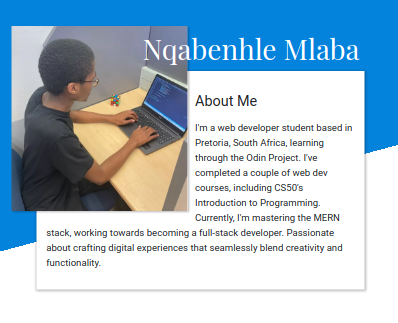

# Homepage

    

This is a final HTML/CSS project. The purpose of this project was to create a responsive homepage and practice the more advanced HTML and CSS concepts we have learned. It includes my pictures, some of the information about me, my work, and my contact details.

## Preview

[Live Preview](https://lindelwa122.github.io/odin-homepage)

## Credits

- [This project](https://www.theodinproject.com/lessons/node-path-advanced-html-and-css-homepage) is part of [the Odin Project's curriculum](https://www.theodinproject.com).
- Website designed by the Odin Project's authors.
- Fonts taken from [Google Fonts](https://fonts.google.com).
